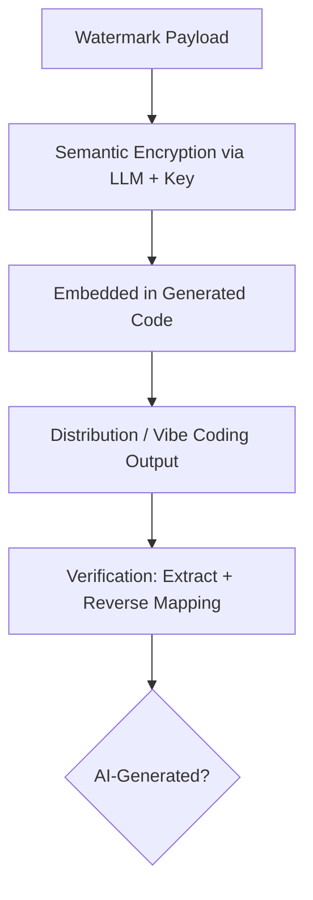
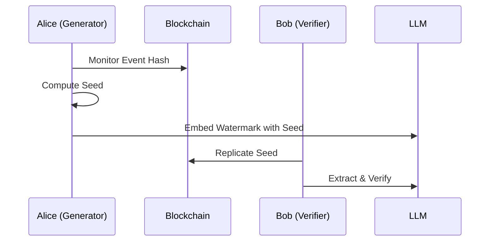
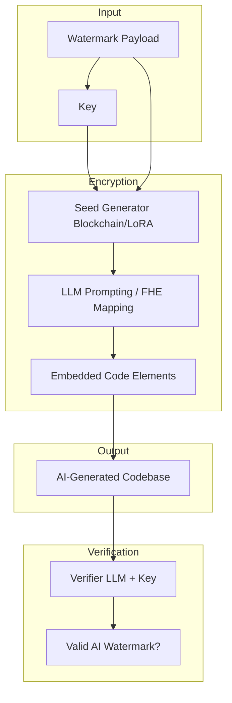

# LLM-Based Semantic Encryption for Watermarking AI-Generated Code

## Table of Contents

- [LLM-Based Semantic Encryption for Watermarking AI-Generated Code](#llm-based-semantic-encryption-for-watermarking-ai-generated-code)
  - [Table of Contents](#table-of-contents)
  - [Abstract](#abstract)
  - [Introduction](#introduction)
    - [Overview of Semantic Watermarking in Code](#overview-of-semantic-watermarking-in-code)
    - [Motivation and Relevance](#motivation-and-relevance)
  - [Background and Literature Review](#background-and-literature-review)
    - [Fundamentals of LLMs, Steganography, and Code Watermarking](#fundamentals-of-llms-steganography-and-code-watermarking)
    - [Related Works](#related-works)
    - [Gaps in Existing Research](#gaps-in-existing-research)
  - [Proposed Framework](#proposed-framework)
    - [Addressing Poor Determinism](#addressing-poor-determinism)
      - [Blockchain-Synchronized Dynamic Seed Generation](#blockchain-synchronized-dynamic-seed-generation)
      - [LoRA-Tuned Dedicated Deterministic Models](#lora-tuned-dedicated-deterministic-models)
    - [Addressing Complex Key Management](#addressing-complex-key-management)
      - [MPC-Based Distributed Key Generation](#mpc-based-distributed-key-generation)
      - [Steganographic Key Embedding](#steganographic-key-embedding)
    - [Addressing Weak Security and Detectability](#addressing-weak-security-and-detectability)
      - [FHE Hybrid Layer](#fhe-hybrid-layer)
      - [Differential Steganography with Multi-Layer Mapping](#differential-steganography-with-multi-layer-mapping)
    - [Enhancing Strengths for Code Contexts](#enhancing-strengths-for-code-contexts)
      - [Context-Adaptive Dynamic Embedding](#context-adaptive-dynamic-embedding)
      - [Community-Driven Model Sharing](#community-driven-model-sharing)
  - [Implementation and Feasibility Analysis](#implementation-and-feasibility-analysis)
    - [System Architecture](#system-architecture)
    - [Prototyping and Tools](#prototyping-and-tools)
  - [Evaluation, Benefits, and Challenges](#evaluation-benefits-and-challenges)
    - [Performance Metrics](#performance-metrics)
    - [Benefits](#benefits)
    - [Challenges and Mitigations](#challenges-and-mitigations)
  - [Conclusion and Future Work](#conclusion-and-future-work)
  - [References](#references)
  - [Document Data](#document-data)

## Abstract

This technical report adapts LLM-based semantic encryption techniques to embed verifiable watermarks in AI-generated code. Amid the proliferation of "vibe coding", where LLMs produce voluminous, often buggy, logically flawed, or insecure code with minimal meaningful contribution, I propose embedding hidden semantic watermarks (inspired by techniques like Google's SynthID) to enable reliable detection of AI authorship. 

The approach maps a compact watermark payload (e.g., model ID, timestamp, hash of prompt) into semantically coherent but unrelated code comments, variable names, function structures, or docstrings that blend naturally into the codebase. Drawing from the referenced work on LLM semantic encryption, I address challenges in determinism, key management, and security while leveraging code-specific strengths such as syntactic flexibility and static analysis compatibility. This framework integrates blockchain seeds, LoRA-tuned models, MPC, FHE hybrids, and differential mapping for robust, verifiable watermarking.

## Introduction

### Overview of Semantic Watermarking in Code

Traditional code watermarking often relies on syntactic modifications (e.g., dead code insertion) or metadata, which are easily stripped or detected as unnatural. LLM-based **semantic encryption** offers a superior paradigm: the watermark is encoded as a high-level semantic mapping that transforms a secret payload into plausible, human-like code elements. 

For example, a watermark payload `MODEL:llama3.1-405B;TS:20260703;PROMPT_HASH:abc123` could be semantically encrypted into a seemingly innocuous comment block or a set of helper functions whose names and logic form a coherent narrative unrelated to the core algorithm, such as a subtle "story" embedded via variable naming patterns or conditional structures.

Decoding requires the shared key and the same LLM (or tuned variant) to reverse the mapping. This achieves **high concealment** while remaining robust to refactoring, as the semantic essence persists.

### Motivation and Relevance

"Vibe coding" with LLMs has led to an explosion of low-quality, insecure, and logically inconsistent codebases. Without reliable provenance, maintainers face challenges in auditing, liability, and quality control. Watermarking akin to SynthID for images/text provides a scalable solution for code.

By building on semantic encryption principles, I enable:
- **Post-hoc verification** by static analyzers, IDE plugins, or LLM verifiers.
- **Resistance to common stripping** (e.g., minification, refactoring).
- **Integration** with existing AI safety and provenance tools.

This is especially relevant in 2026, with growing regulatory scrutiny on AI-generated artifacts and the need for accountable software supply chains.

## Background and Literature Review

### Fundamentals of LLMs, Steganography, and Code Watermarking

LLMs excel at generating coherent code but suffer from stochastic outputs and lack of built-in provenance. Text/code steganography hides information in natural structures (e.g., via synonym substitution, syntax trees, or prompt-driven generation). Code offers unique carriers: comments, identifiers, control flow graphs, and docstrings.

SynthID-style watermarks embed statistical signals imperceptible to humans but detectable via specialized extractors. Semantic encryption elevates this by using LLM generative power for context-aware, high-capacity hiding.

### Related Works

- Generative text/code steganography using LLMs for embedding in narratives or code comments.
- Robust LLM steganography resistant to paraphrasing/refactoring.
- SynthID and similar provenance tools for AI outputs.
- Hybrid crypto-AI systems (FHE for encrypted inference, LoRA for determinism).
- Blockchain for verifiable randomness in watermark seeds.

### Gaps in Existing Research

Existing code watermarking lacks deep integration with LLM semantics for natural concealment. Watermarks are often fragile to refactoring or easily detectable as artificial. This report fills the gap by adapting semantic encryption primitives specifically for code artifacts.

## Proposed Framework

### Addressing Poor Determinism

#### Blockchain-Synchronized Dynamic Seed Generation

Use blockchain events (e.g., block hashes) as shared, verifiable seeds for LLM generation.

**Implementation**:
1. Agree on smart contract for event monitoring.
2. `seed = SHA256(key || block_hash || prompt_hash)`
3. Prompt LLM with seeded generation for reproducible watermark embedding.

**Mermaid Flow**:

#### LoRA-Tuned Dedicated Deterministic Models

Fine-tune small LLMs/code models (e.g., CodeLlama) with LoRA on watermark-specific prompt-output pairs to minimize variance.

### Addressing Complex Key Management

#### MPC-Based Distributed Key Generation

Multiple parties jointly generate keys without revealing shares, suitable for enterprise watermark authorities.

#### Steganographic Key Embedding

Embed key fragments within generated code comments or idle functions using acrostics or semantic patterns.

### Addressing Weak Security and Detectability

#### FHE Hybrid Layer

AES-encrypt payload -> FHE-secure mapping via LLM -> Embed. Enables secure verification without exposing keys.

#### Differential Steganography with Multi-Layer Mapping

Generate multiple candidate embeddings; select one via `index = hash(key) % N`. Increases resistance to steganalysis.

### Enhancing Strengths for Code Contexts

#### Context-Adaptive Dynamic Embedding

Adapt watermark style to surrounding code context (e.g., match project coding conventions, language idioms).

#### Community-Driven Model Sharing

Share tuned watermarking LoRAs on Hugging Face for diverse, harder-to-reverse-engineer mappings.

## Implementation and Feasibility Analysis

### System Architecture

### Prototyping and Tools

- **LLMs**: CodeLlama, DeepSeek-Coder + LoRA (Hugging Face).
- **Crypto**: web3.py, Concrete-ML (FHE), MP-SPDZ.
- **Analysis**: Static tools (e.g., Semgrep) + custom LLM verifier.
- **Testing**: Generate sample codebases and attempt detection/refactoring attacks.

## Evaluation, Benefits, and Challenges

### Performance Metrics

- **Embedding Capacity**: Bits per KB of code (target: 10-50+ via semantic density).
- **Detectability**: Perplexity, statistical tests, human studies.
- **Robustness**: Survival rate under refactoring, minification, paraphrasing.
- **Overhead**: Generation latency (<5s per function with optimized models).

### Benefits

- **Provenance Tracking**: Easily verify AI-generated portions in mixed codebases.
- **Quality Control**: Flag low-effort "vibe coding" outputs.
- **Security**: Hard-to-remove without destroying code utility.
- **Scalability**: Integrates with CI/CD pipelines.

### Challenges and Mitigations

- **Refactoring Resistance**: Use multi-layer semantic invariants (mitigated by differential mapping).
- **False Positives**: Tune with domain-specific training data.
- **Compute Cost**: LoRA + quantization for edge deployment.
- **Adversarial Attacks**: Regular model updates and community sharing.

## Conclusion and Future Work

This framework provides a practical, creative application of LLM semantic encryption for watermarking AI-generated code, directly addressing the pitfalls of unchecked vibe coding. By combining cryptographic rigor with generative naturalness, it advances trustworthy AI-assisted software development.

## References

- Ben, Wu, C.(2025). Creative and Feasible Ideas for LLM-Based Semantic Encryption. Document Identification Code: 20260703_01.
- LLM steganography
- SynthID
- LoRA 
- FHE
- MPC

## Document Data

- Author: Carson Wu
- Document Identification Code: 20260704_01
- The development timeline: 2025 - Present

